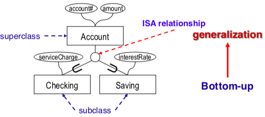
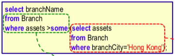
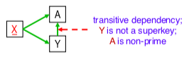
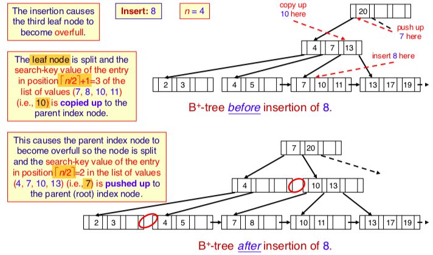
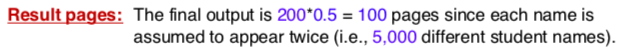

- [ER diagram](#er-diagram)
- [Relation algebra](#relation-algebra)
  * [Set operation](#set-operation)
  * [Join](#join)
- [SQL](#sql)
  * [Set membership\ nested \ sub-querey](#set-membership--nested---sub-querey)
  * [Groupby](#groupby)
  * [**Create and Modify Relations**](#--create-and-modify-relations--)
- [Functional dependency](#functional-dependency)
  * [Storage](#storage)
  * [Ordered Index](#ordered-index)
  * [B+ tree index](#b--tree-index)
  * [Hash index](#hash-index)
  * [Bitmap index](#bitmap-index)
  * [Query cost estimation](#query-cost-estimation)
  * [Optimization](#optimization)
  * [Transaction, concurrency](#transaction--concurrency)
  * [Recovery](#recovery)


### Note

- candidate key might have multiple, try more
- `distinct ` when want to get one attribute without duplication 
- ; in complete sql query 
- if didn't use `natural join` in `from`, `select`, `group by` need to specify which table 
- any join with specifc `XX.xx = YY.xx` will keep both columns with same name
- left\right outer join need to specify `on XX.xx = YY.xx`
- set operation (union, intersect, minus) remove duplicate; set membership (in )retain duplicate, use `distinct`
- attribute in `select` must in `group by`,`having`


### ER diagram

**Generalization/specialization** is a relationship between the **same kind** of entities playing different roles.

subclass: user-defined

 top-down (attribute-defined)


**Inheritance** is the taking up of properties by a subclass from its superclass.

use role name in unary relationship 

- degree of relationship usually has two

- an entity must has attribute, relationship dont need to have attribute

- degree of a relation is the number of attributes

  

**Constraint**

attribute/domain constraint:restricts an attribute to only have certain values 

An entity may have **more than one key.** only one primary key


- **discriminator(dash) for weak entity;**

- **composite key(solid) for strong entity** 


**Strong entity**: An entity that has a primary key.
**Weak entity**: An entity that does not have a primary key.


**Surrogate key**: a new attribute introduce into an entity to be the primary key  (make weak entity strong \ replace strong entity composite key)


minimum cardinality (min-card)  —> participation constraint

maximum cardinality (max-card)  —> cardinality constraint  

**cardinality constraints for relationship** 1:1 \ 1:N \ N:M 


**min-card(E1,R) = 0  partial participation
min-card(E1,R) > 0  total participation**


**Identifying relationship**:

- A weak entity must **depend on** a/some strong entity (identifying entity)

- **has identify relationship must has dash on weak entity**, has dash might not has identifying relationship to all entity  

- condition: 

  - 1. many to one relationship\card is one  
    2. participation of weak entity is total

  

**Discriminator for weak (use dash)**: An attribute **uniquely** identifies an instance/ **weak entity** given a key value for the **strong entity**  


> offering is still weak entity, offering is the **depedent** of course, has **one and only one** course


> A student don't need to enroll in a offering as soon as the student record is create! partial participation, so **offering don't depend on student!**


**Exclusion constraint**: (either one of them, not both)

 


**Relation(instance)** is any subset of the Cartesian product of some domains of values.

**Entity integrity constraint**: If X is a primary key of R, then X cannot contain null values.

**Referential integrity (foreign key) constraint**

**foreign key** 

- either equal to the **value** of the **primary key KS** of a tuple in **S**
- or entirely **null**.


**Referential integrity action:**

- **For total participation** on delete cascade (on foreign key value)

- **For partial participation** on delete set null 


**Reduce generalization**

**Option 1**:  

- relation schema for both superclass and subclass 

- foreign key (FK) references superclass-relation-schema(K); on delete cascade 

select when subclass entity have its own attributes and **superclass has other relationship** 

**Option2**:  

- relation schema for subclass only, include **all attributes of superclass**        	

  only for **total, disjoint**


**Reduce composite** 

Option 1: create a signle attribute by concatenating components (firstname+lastname)

Option 2: create seperate: S(school, firstname, lastname, age ...)


**Reduce multivalued**  

create new relation schema SM, foreignkey (FKS) references S(KS), on delete cascade.


**Reduce strong entity**: create relation schema with all attribute and primary key 

**Reduce weak entity**: with depend on only **one strong entity** 

- create relation schema with all attribute of weak entity
- include **attribute Ar of relationship R**  
- include foreign key, the primary key of strong entity which depend on
- primary key: **union of foreign key and discriminator of weak entity** 
- foreign key (FKS) references S(KS); on delete cascade. 


**Reduce binary relationship**:  for a relationship, always on delete cascade

- include all attributes of the relationship
- include **primary key of both side as foreign key**    ( need to add reference and action!)
- primary key: 
  - 1:1 relationship -> either side;   
  - 1:N relationship -> on N-side;  
  - N:M relationship -> union of both side 

- combine relationship with entity schema 
  - 1:1 relationship -> can combine with either entity 
  - 1:N relationship -> combine with N-side;   (the side closer to N)
- add foreign key constraints and referential integrity action for foreign key on **N-side**


**Reduce exclusion constraints**


### Relation algebra

**C1 ∧ C2  AND      C1 ∨ C2  OR       ¬ C   NOT**

**Selection: σC(R)**           

**Projection: πL(R)**  eliminates duplicate tuples


#### Set operation

 two relation have **same attribute**,result is one relation no duplicate columns

- **union**; 并集: appear in table 1 or table 2
- **− set difference**: (appear in table1 not in table2, table1-table2)
- **∩ intersection**:  r ∩ s = r - (r-s) 交集: appear in both table 1 and table 2


#### Join 

**Cartesian product** X  combines each row of one table with every row of another table.

- combine all columns of two tables
- restrict by match the same attribute between two tables table1.model = table2.model


**Join** (restrict X by selection)

- JOIN  **keep both columns with same name**

- **natural join**: Combines two relations on the equality of the attribute values with the same names. **ONLY one column with same name keep!** 

- **θ-join**: Allows arbitrary conditions in the selection. **use in self join!**  

  

- **equijoin**: All conditions are equality. 

- **Outer join**  fill null in missing info `from XXX left outer join XXX on XXX` 

  **keep both the replicate column in the table**
  
  - left outer join 
  - right outer join 
  - full outer join 


```plsql
SELECT column_name(s)
from sailor left outer join reserves --left table has more row
on sailor.sailorId = reserves.sailorId;  --on!!
```

`left join` result in two columns name `sailorId`, one sailorId from `reserves` will have `null` value, count on sailorId in `reserves` 


Three methods to find the same tuples, but with different result size


Add projection to reduce the column number left only the one needed"


Reserved both red and green boat:


> Find the repeat name in two tables, find occur in both table use interesction 
>
> sName is not unique, need to use {sailorId, sName} to do intersection, then find sName

​	second method use join: 


>  methods:  1. set operation   2. and    3. set membership 


### SQL

- String values must be enclosed in **single quotes**.

- rename in`select` use `as` ; in `from` just `Loan L`, then can use in `select`	`L.loanNo` 

  

`like %China%`   **case-sensitive**   

- % match any substring;   `china%` begin with china
-  _ match any single character 

double vowel:

`where amount between 100000 and 200000;`   ≥$100,000 and ≤$200,000

`where amount not between 100000 and 200000;`   <$100,000 and >$200,000

`SELECT ROUND(column_name, integer)`

`SELECT SUM(column_name)`   sum of all number in a column

`where (color='red' or color='green')`


**union**, **intersect**, and **except** (minus in oracle) automatically **removes duplicates**.

keep duplicate:


#### Set membership\ nested \ sub-querey 

   `IN, NOT IN, SOME, ALL` **duplicates are retained!**

Find all clients who have both an account and a loan.

> **In**: follow can be a set not a number 


Find all clients who have a loan, but do not have an account. 

> **not in**: 


 

  

Find the names of all branches that have greater assets than some (i.e., at least one) branch located in Hong Kong 

> Two methods: 
>
> **Some**: greater than minimum of ... 
>
> (`= some`) is equivalent to `in` 


> **All**: greater than maximum of… 
>
> (`=\ all`) is equivalent to `not in`   
>
> find the **highest** rating: 
>
> find the lowest rating: <= all
>
> another method: 


> **exists** operator returns true if the subquery is not empty (i.e.,the subquery returns at least one row).
>
> 
>
> **not exists** operator returns true if the subquery is empty (i.e. subquery return no row)


 **unique** operator tests for the non existence (i.e., absence) of duplicate tuples in a subquery

- can use `group by` and `having count(*) =1` 

**not unique** operator tests for the existence (i.e., presence) of duplicate tuples in a subquery


**when `from` contain a subquery:** 

> - want to apply max(avg(attribute))
>- want to compare a group average with total average 
> 
> 


**aggregation subquery**

```plsql
select firstName, lastName, cga from Student  
where cga=(select min(cga)   --cannot write  cga = min(cga)
					from Student);
```

```sql
select departmentId, trunc(avg(cga), 2) as “avgCGA” from Student
group by departmentId
--first avg(cga) is group average, second is average of all cga
having avg(cga)>(select avg(cga)     
									from Student);
```


#### Groupby

> **group by with join**:  not same as count
>
> **Group by** can be represent in **self join**: 


#### **Create and Modify Relations**

**domain type**: **char**(*n*), **varchar2**(*n*), **int**, **smallint**,  **float**(*n*), **date**,
**time**, **timestamp** (null value is allowed in all)

**number**(*p*,*d*)-A fixed point number with a total of p digits (the precision) and d digits to the right of the decimal point.,

**unique** specify an/a set of attribute is a candidate key, one of which choose as primary key

```plsql
create table Section (
semester char(6),
year char(4) check (year between ‘2019' and ‘2023'), check (semester in ('Fall', 'Winter', 'Spring', 'Summer')));
```

**view** can hide certain data from certain users

**not all views allow update:**


**Case**


**Update** 


### Functional dependency

**Super Key**:  one or more attributes can identify a record *uniquely* in a table

> **X+ identify superkey but not candidate key!** 

**Candidate Key:**   minimal super key

> a subset of candidate key is not a candidate key

**Primary Key:** one Candidate Key is chosen to be Primary Key.  non-null

**FD**: for a value in X there will be at **most one** value in Y,

​		 **X** **determines** **Y** **or** **Y** **depends on** **X**, **X—>Y** 

> To test X->Y holds, compute X+ and check if Y ⊆ X+


**Other attribute must depend on primary key** 

> PGStudent (<u>studentId</u>, name, supervisor, specialization) 

> studentId → name, supervisor, specialization


Get the **closure F+**(if X->Y then Y is in X closure, repeat for Y in X) by applying: 

**IR1: Reflexivity**				  If Y ⊆ X, then X→Y (trivial FD) 

**IR2: Augmentation**			{X→Y} |= XZ→YZ

**IR3: Transitivity** 				 {X→Y, Y→Z} |= X→Z 

**IR4: Union** 							{X→Y, X→Z} |= X→YZ 

**IR5: Decomposition**		   {X→YZ} |= X→Y and X→Z 

**IR6: Psuedotransitivity** 	{X→Y, WY→Z} |= WX→Z 

All FD logically implied by F is called the **closure** of F denoted as F+.

- F covers G if 
- If G can cover F, but F cannot cover G, then 


**Find candidate key**


> First, A+ = {ABCDE}, A is candidate key, 
>
> E—>A, E is a candidate key,
>
> CD→E,  CD is a candidate key,
>
> BC→CD, BC is a candidate key 


**Normalization** goals:

> 1: Clear Semantics for Attributes
>
> 2: Minimize Use of Null Values
>
> 3: Minimize Redundancy: no insertion, deletion or update anomalies occur
>
> **has redundancy if there's a FD where LHS is not a key**
>
> 4: Lossless Decomposition
>
> common attribute B is not superkey, B doesn't has at most one C and A
>
> 
>
> ​					C—> B, C—>A
>
> 5: Preserve Functional Dependencies


**Step to find canonical cover Fc**, can equal to F

- iterate:  **union** X→Y and X→Z find X→YZ    
- delete extraneous attribute in LHS and RHS 

**Redundancy/extraneous**:

- occur in **RHS**: find out by union or transitivity 

- occur in **LHS**: { A→B, B→C, AC→D } can be simplified to { A→B, B→C, A→D }

  > A —> C, so don't need A together with C to determine D


Find cononical cover


> ACD —> B and B —> E, so ACD —> E
>
> already have AC —> E, D is extraneous, only need to keep one AC —> E

from AB —> B, we don't know A —>B! only if {AB —> B, A —>B} we can remove to { A —>B}


> BC—>A, remove A to BC—>D  union      {A→C, BC→AD}


**Steps to test lossless, functional dependencies**

- Lossless: the common attributes of R1 and R2 must be a **superkey** for R1 **or** R2

  if has R1 R2 R3, find common attribute from every two R (R1R2 or R1R3 or R2R3)

- Functional Dependencies: **every FD** must be represented in relation schema of R1 **or** R2

  


**Steps to find whether is 3NF**

option 1: fulfill LHS superkey or RHS prime attribute

option2: find candidate key of relation 

​				find non prime attribute 

​				see whether has FD is non prime attribute determine non prime 


**Steps to find 3NF normalization** (must satisfy dependency preserving)

- If R is not in 3NF:

- Compute **cononical cover Fc** 

- **For each** FD in Fc,  X→Y, create a relation schema for each FD 

  **if a FD already in relation schema, no matter it's not primary key, can skip it**

- If no schema contains a candidate key for R, add **any candidate key** as a relation schema


**Steps to find whether is BCNF**

LHS is superkey 


**check after split the relation, remaining FD whether LHS is superkey of new relation**

**Steps to find BCNF normalization** 

- Iterate if LHS of **remaining FD** is not superkey of the **new R**: (can ignore the FD not present in Rn)
  - Pick a FD that violate BCNF : X—> Y
  - Remove the **RHS** Y from relation schema R to relation schema R1 (**keep candidate key in R1!**)
  - Create a new relation schema R2 for the FD X→Y

  

- For **decomposed relation schemas**

  - check whether relations are lossless, if not, remove the not lossless one
  - OR use FD in F+: consider all attributes cover: **Each attribute** (e.g., A) has to determine **everything** in R1 (i.e., it is a key) or **nothing** (e.g., B). 


R2(A,B) is BCNF; R1(A,C,D) is not: A —> C, does not determine everything in R1

 


 


**Prime attribute**: if it is part of **any** candidate key.

**First Normal Form (1NF)**

if all attributes are atomic (single-valued), no multi-valued or composite attributes, Relation schemas are always in 1NF


**Second Normal Form (2NF)**   not allow partial dependency 

 not allow:

> **X is proper subset of a candidate key XY**, A is not a prime attribute, so not in 2NF
>
> **XY is not a subset of XY**, so XY—> A satisfy, but since X—> A not satisfy, not in 2NF
>
> for transitive dependency, in 2NF, in following gragh, Y is not a proper subset of candidate key

**normalization**: seperate the partial dependency FD into new table, check whether fulfill lossless and functional dependency requirement   


**Third Normal Form (3NF)**  not allow transitive dependency, still have redundancy  

 not allow:

> Y is not a superkey, A is not a prime attribute, so not in 3NF 
>
> only for 3NF: no extraneous attribute means *LHS is a **candidate** key*,**or** *RHS is a prime attribute*

**normalization**: seperate the transitive dependency FD into new table 


**Boyce-Codd Normal Form (BCNF)** : have no redundancy

- avoids the problems of redundancy and all anomalies
- always a lossless decomposition
- all the functional dependencies may **not** be preserved.


**Denormalization**

display two attribute in different relation schema in the same table can use JOIN of two relation schema 


####  Storage

Main memory (RAM) need to read I/O from disk to perform any operation

Application —> buffer pool (in main memory)—> disk


**Buffer replacement policy**

least recently used (LRU strategy): evict least recent used page, bad for repeat recent use

most recently used (MRU strategy): most recent used page store in the head of link list (access first)

leave a page for storing the result of each two page join, if that page is full, store in disk


**File(page) organization**

 file, can have multiple pages —— make up of —— record(fixed size) —— is a sequence of —— fields


**Fixed length**: each record has the same length n

adv: easy to find the record i with size n: starting from byte` n ∗ (i – 1)`

- **free list**: store the empty address(deleted record) in the header

**variable length**:

adv: size is smaller, record load faster 

disadv: don't know where the record start, so process slower

- **byte string representation:**end-of-record symbol to the end of each record 

  - disadv: deletion has fragment of free space; growth need to move record 

- **reserved space**: fixed length record of known max length, unused fill with null 

- **pointer method**: good for record with repeating attributes

  -  **Anchor page**:Contains the first records of a chain.

  - **Overflow page**: Contains records other than those that are the first records of a chain

  - pointer

     repeat account, balance of record

- **slotted page structure**: every page has header, record can move around within a page with no empty space between them, header will update if record is moved

  reference to record point to entry in the page header 


**Record organization in files**

- **Heap**: 
  - no order; a record can be placed anywhere in the **file** where there is space.
  - need to use pointer track of page, free space, record in a page, can use slotted
  - linked list (free list)
  - page directory (pointer method)
- **Sequential**: 
  - Records are ordered, the first record point to the next one
  - *suitable application*: process of entire file
- **Hashing**: 
  - each bucket store the record, which the address is the hash value
  - **a bucket is usually a page** , if a bucket is full we create an overflow bucket
  - to avoid easy overflow: pages are only 80% full: calculate record number of page needed: `(#record / bf) / 0.8`
  - *suitable application*: equality search, not good for range search because might in different bucket 
  - if no overflow bucket, **cost of equality query is 1 page/bucket** 


In calculating cost: ignore CPU cost: searching a page in memory


**blocking factor, bf**: how many records can put per page : 

`⎣# bytes per page / # bytes per record⎦`

**number of pages** needed to store a file :

`⎡# records / bf⎤`


####  Ordered Index

**Search key**: the attribute used to search for records in a file

- primary key can always be a search key
- search key might not necessarily be a primary key (can be a candidate key)
- if find record given not a search key, need to build a new ordered\tree index 

**Index file**: file consist of index entries <search key, pointer> 

**Index entry**：

- use index can fit more index in a page than the actual record

- **use each index entry in index page point to the first record of each data page **
- **single level index tree** with 10 pages, search cost to record is `log2(10) +1` 


**ordered\tree index**: 

- index entries are sorted on search key
- searching for a record start from the root and follow a single path to the leaf
- an additional access to data file
- good for equality and range search 

**index page is an index node**

**fan-out** : **number of pointer of a index node**  OR  **number of index per page** 

**height of the tree** :multi-level index tree

**number of index pages need in the tree**: leaf node page + different level of the tree's #page 


**Primary index** (**clustering index**): file (Index-sequential file) is sorted **based on search key** of index

**Sparse Index**: index entry don't contain all value, because primary index is sorted

- has index entries for the first record in each page of the file, `log100(1mio)+1` cost
- number of search-key values in the leaf nodes is equal to the number of pages (not number of data) of the file.


**Secondary index** (**non-clustering index**):  file is not sorted based on search key of index

**Dense Index** : applicable to secondary index: all record has one-to-one index entry

- find a record with an attribute that the file is not sorted based on it, build another **dense index**, so every 8mio of residents has an index entry, `log100(8mio)+1`cost 
- when retreve a single record, cost of secondary similar to primary index, but for range query, since the file is not ordered by that index, the result might allocate in multiple page; primary index might likely to store the range record in the same page


**Ordered index on non-candidate key** (has duplicate record with same attribute value)


disadv of index file: performance degrade as file grows


####  B+ tree index

**fan out**: maximun number of children\pointer `n`

**order**: minimun number of value in leaf node `⎡(n-1)/2⎤` 

each index file has `number of value = pointers +1`

the nodes are at least half filled:

  


**Non-leaf(internal) nodes** form a multi-level, sparse index on the leaf nodes 

For non-leaf node with n pointers: 

- First P1: less than K1
- Internal P2 ….: **greater than or equal** to K1, less than k2
- Final Pn: less than Kn-1  


**Leaf node** 

- pointers either point to **data file** with search-key K, or a **bucket of pointers** each of which point to a data file has search-key K 
- value in a node is in sorted order 
- last pointer in leaf node points to the next leaf node in order or has end symbol


**B+ tree on (primary) candidate key, in order** 

dense:


sparse:


**B+ tree on (non-primary) candidate key, not in order, must be dense**


**B+ tree on non-candidate key, in order, but has duplicate search key value**

 point to the first record in the file with that value


**B+ tree on non-candidate key, not in order, has buckets of pointers**

need one more page access


**Query**: 

- cost in B+ tree: `⎡log⎡n/2⎤(K)⎤` node or page, k is the search key value(in leaf node), n is fan-out

  - if B+ tree non key and not in order, `+ cost to access buckets of pointer`
  - and `+ cost of retrive needed record from buckets of pointer` 

- assume each node holds the **minimum** number of values,  assume each node is a page in B+ tree

   

**Insert** 

- always insert to the leaf node
- leaf node 
- split will not have pointers
- **leaf node `⎡n/2⎤+1` position split and copy up**
- **non-leaf node `⎡n/2⎤`position split and push up** (delete and create new in parent)



**Delete**

- borrow from left or right sibling (has a split)
- delete borrow sibling's parent node 
  - copy up `⎡n/2⎤+1`  position of leaf node
- **If no sibling to borrow, then consider to merge**
  -  delete parent node
  - if root node has only **one pointer**, the tree shrink one level, then **delete root node**, add 23 if needed


**B+ tree in file organization** 

- **B+ tree leaf node store record, not pointer**, no need to +1 for search cost
- since record is larger than pointer, max number of record can be stored in leaf node is less than the number of pointers in non-leaf node
- leaf node required to be half full, not easy to cause split or merge


**B+ tree bulk loading**

- because repeatedly insert record need to read and write leaf node, costly
- bulk loading: **sort all data entries**using external sorting, insert pointer to first  leaf page in a new root page
- new data entries alway enter into **right-most** page and link to new parent node


#### Hash index

multiple **index entries** v partition into buckets in accordance with hash function h, with address a, if h(v) = a, same a in the same bucket

- different from hash file organization, each bucket store hash index entry
- assume each bucket store in a page
- find a index: fetch bucket at h(v), search bucket
- **hash index is secondary index, not order**, because the file would use a hash file organization, no meaning to build a hash on a hash
- Hashing not support range search(because each value might have different hash value, so in different pages), but good for equity search(1 page IO)


**static hashing**: a function h maps search-key values to a **fixed set B** of bucket (page) addresses.

- problem: initial of bucket too small cause overflow or database shrink will waste space

**dynamic hashing**: allow the hash function (number of buckets) to be modified dynamically

- can double number of buckets when a bucket is full, and reading and writing all page
- or use directory of pointers to buckets, directory smaller than data file, double has lower cost


#### Bitmap index

is an array of bit  

- efficient querying on **multiple** search keys, not useful for single attribute queries
- applicable for attribute take on small number of distinct value 多1
- each value of an attribute has a bit, 1 for has this attribute, 0 for not


#### Query cost estimation

**A1 linear search**

Scan each page and find all records satisfy the selection condition, not sorted

cost:        select on non-key attribute(might has duplicate): `B`        key attribute: `B/2`


**A2 binary search**

Equality comparison on file that is **sorted**, **not involve index**

cost:   `⎡ log2 B⎤+ number of page`

​   locate the first tuple   also satisfy requirement (duplicate)


**A3 primary index search on key**

Retrieve a **single** record that by index satisfy equality constraint

cost:   **tree index**: `HT +1`     hash index: don't need hash for primary index


**A4 primary index search on nonkey**

Retrieve **multiple** records that satisfy equality condition on consecutive pages. 

cost: `HT + number of page satisfy condition`      


**A5 secondary index**

- Retrieve a single record if the search key is a **candidate** key.

  cost: **tree index**: `HT +1`     **hash index**:`1+1`      or `1.2+1` if has overflow bucket

- secondary index with no key

  cost: **tree index**: `HT + number of record retrieve`

  (because each record might in different pages, so all record need to have a page IO)

  ​   **hash index** : `1+number of record retrieve` or `1.2+number of record retrieve`

  can be expensive: if different record on the same page, need to retrive the same page multiple times


**A6 primary index in selection** 

  


**A7 secondary index in selection** 

  

L16


[**External merge sort algorithm**](https://www.youtube.com/watch?v=qzanYihCHJk)

 


**Cost: `2 * total pages * number of pass`**

 


**Join operation**

**use smaller relation as outer relation** 

**r–outer relation; s–inner relation;  B number of page;  N number of tuple**

**nested-loop join**  - require no indexes and use in any join

  

worst case: `Nr * Bs + Br`   only 1 memory page available for each relation

best case: `Br + Bs`        when both relation fit into memory  


**block nested-loop join**  - require no indexes and use in any join

    

worst case: `Br * Bs + Br`   only 1 memory page available for each relation

best case: `Br + Bs`        when inner **relation s  fit into memory**  

If a relation fits in memory, use it as the **inner relation s**. If neither relation fits in memory, use the **smaller relation as the outer relation r**.


**block nested-loop join** , optimization

in most case: memory size is more than 1 page


**indexed nested-loop join**   - for equi-join and natural join, index available on **inner** relation

  c: hash index cost: 1+1   B+tree index cost: tree height+1


  


**Merge join**   - for equi-join and natural join

**can eliminate extra attribute when doing the sort, write less. loop join can't eliminate** 

  


 

​   **optimization**

​   when the memory is large enough to fit both relation after sorting pass the same time, sailor don't need to write and read the result, can perform join with Reserve after read:417 and read 850

  


**if memory is large enough to fit two table's run**

 


**Hash join**    - for equi-join and natural join

  

- hash function h partition tuple of relation r and s into n bucket (number of bucket should be choose to ensure size of bucket less than memory)   read and write r and s once
- read bucket r **build input** to build in-memory has hindex on it with join attribute  
- read bucket s **probe input** from disk page by page to match r using its hash index


**Projection operation**

- **using sorting**

pass0: eliminate unwanted attribute     read original relation r0, write smaller r1

pass1: eliminate duplicates          read r1 to merge, perform elimination, don't need to write output

  

 

​    **because merge only need 1pass, cost = (200 * 1 * 2 ) - 200   deduct the write back**

  

  


- **using hashing**

partioning phase:   read original relation r0, discard unwanted attribute, write smaller r1

duplicate elimination phase:     read r1, use hash perform elimination, don't need to write output


 **index-only scan**: scan index only without accessing data file, need to read smaller page, since each page can store more index. **index must be dense**: in order to scan data 


**set operation**

- **using sorting**

     

- **using hashing**

     

  

  **the cost of set operation is the same as projection**


**Aggregate operation**  min max sum count

**without grouping** 

- scan all tuple in relation
- if has tree index include all attribute , do index-only scan

**with grouping**

- COUNT: group student by groupId, without eliminate but count the number of student in a group

- if has tree index include all attribute , do index-only scan


####  Optimization

V(A,r) =  number of **distinct** values of A in *r* = **group by A**

**SC(θ, *r*) average number of tuples that satisfy θ**

**Selectivity(θ, r) = SC(θ, *r*) / nr**         (i.e., the fraction of tuples that satisfy θ)


**equality selection** 

- assume uniform distribution of value A over v

   

- if tuple is ordered on A, number of **page**: 

- if not ordered, each tuple can in a different page, #page = # tuple

- equality selection on a **key**: SC = 1

- binary search (in order) cost: 


**range selection** 


can use **histogram** to assume local uniformity within each bucket

**multidimensional histogram** can count for attribute that are not independent


 **SC = N * P1 * P2**

 **sc = N * (1 - (1 - P1) * (1 - P2) * ))**


**Join size estimation**

- Cartesian product r x s contains **Nr * Ns** tuples. Each tuple occupies **Sr + Ss** bytes
- r Join s, if no common attribute, **size same as cartesian product Nr * Ns**
- r Join s, if has common attribute is a **key** for r, the result size is **no greater than s**
- r Join s, if has common attribute is a **foreign key** in s referencing r, the result size is s
- r Join s, if has common attribute **not a key** for r or s, choose **lower** 
  - V(A,r) is the number of tuple if A is a key


**Set operation size estimation**

 provide **upper bound**


**number of distinct value**

- selection condition is on the attribute 

- other case: 

- distinct value from join: 

- aggregate value: 
- aggregate value other cases:


**Relational algebra tree**


represent the evaluation order, bottom up  


**Materialization**: store(materialize) the result on disk for subsequent use each operation

  

   


**Pipelining**: evaluate operation simultaneously, pass tuple to next operation as they are generate, no store of temporary result

  

- can't use in **sort-merge join** or **hash join** becasue it require intermediate result to written to disk and read back, call **blocking**

-  

- perform selection and projection early, reduce number of tuples and attribute

-  

  


**Complex Join Example**

 

 

 

 


**Get the join result pages size for Temp1, consider join make tuple byte larger!**

 


 

**Get the join result pages size for Temp2**

 


 

 


 

 

 even higher than materialization 


**!sometime scan of entire relation is cheaper than index scan, `#tuple * index I/O` can be high**


####  Transaction, concurrency

ACID properties:  

- atomicity, either all or none of transaction are reflected
- consistency, sum of A and B is unchanged by the execution of transaction
-  isolation, concurrently executing transactions must be unaware of others
- durability, transaction complete the changes it made to the database persist, even if there are system failures
  

 


**schedule**

 (chronological order of concurrent transaction) must be **serializable, recoverable and preferably cascadeless**

any serializable schedule follow order **R1 first and w1; R2 first and w2** in this case

   


**loss update**: in each transaction, **only write what is readed before**, no matter is it commited , will not happen if it's a serializable schedule 

  


To **preserve cosnsistency** (sum are same), a schedule must be either:

- serial: execute one after the other, n transaction has n! serial schedule
- **serializable**: execute concurrently, in **interleaved** manner that equivalent to a serial schedule 


**conflicting operation** : 1. same Q, 2. at least one write 3. belog to different transaction

  


**get serializa schedule from conflict serializable schedule**:

- follow the **order of arrow** to traverse all table T1—>T2 in this case

- move all operation of T1 up and move all operation of T2 down


**not conflict serializable**: cannot swap to obtain serial schedule 


**precedence graph**: 

direct graph of two transaction **conflict** access **same** item, the earlier one point to the later one

- if the precedence graph has a  cycle, the schedule is not conflict serializable


**dirty read**: 

T2 read value 110 that T1 written in database, but not commited, if T1 fail, and T2 commit before T1, then T2 read the incorrect value 

​   will not happend if it's a recoverable schedule (when roll back would not affect correctness of others)

 

 if T1 roll back before commit, T2 still not read anything, no affect; T2 only read commited result, guarantee to be correct  


**Abort**: 

- transaction roll back and database restore to the state prior to the start of the transaction 
- a commited transaction will never be rolled back


**Recoverable**:  

Ti write(A) before Tj read(A) , **Ti commit before Tj** 

recoverable: not recoveralbe:


Cascading roll back: when a single transaction failure leads to a series of transaction rollbacks.

  


**Cascadeless**:  

Ti write(A) before Tj read(A), **Ti commit before the read of Tj**, cascadeless must be recoverable 

  


**lock** restrict other concurrent transaction can't perform operation on the locked transaction

**Shared lock** - that transaction set the lock can only read
**Exclusive lock** - that transaction set the lock can read and write

- **T1 has shared lock and T2 can only use shared lock**, can't use exclusive lock on the same data 

- **T1 has exclusive lock and T2 can't use both shared lock and exclusive lock**
- 
- so if a lock cannot be granted, the requesting transaction need to wait until all incompatible locks release, then get the grant


**starvation** 

lock-x need to wait until lock-s at T1 release, 

lead to lock-s at T3 T4 T5 suppose can hold shared lock with A, but now need to wait lock-x and wait for lock-s at T1

  


**2 Phase locking**

> before reading x, it sets a read lock on x
>
> before writing x, it sets a write lock on x
>
> it holds each lock until after it executes the corresponding operation
>
> after its first unlock, it requests no new locks in the same transaction

**In each transaction:**

**growing phase**, no unlock; （request or upgrade lock）

**thrinking phase**: after start unlock, no lock  (release or downgrade lock)

  not a 2 phase locking, should all lock first and all unlock follow

use the time **order of lock point** (the last lock before unlock) to determine serializability 

2Phase locking might have problem of **dead lock and starvation**(unecessary wait)


**dead lock** in growing phase

every transaction is waiting for another transaction in the set.

To handle a deadlock, either T1 or T2 must be rolled back and its locks released.

  

 

**Strict 2PL** cascadeless (only after transaction commit, exclusive lock unlock, can perform other read transaction ), has deadlock, can conflict serializability 

only put unlock of **exclusive lock after commit**, share lock can release any time

growing phase —> thrinking phase —> commit —> unlock exclusive lock


**rigourous 2PL** cascadeless, has deadlock

put **all unlock (share or exclusive) after commit** 

transactions can be **serialized in the order** in which they commit.


**Deadlock prevention**  making no transaction access same data the same time

**Wait-die Scheme**: older transaction wait for younger one to release, younger transaction never wait for older just roll back, easy to roll back

**Wound-wait Scheme**： older transaction force rollback of younger transaction instead of wait for it, younger transaction may wait for older one , fewer rollback 

**Timeout-Based Schemes**: transaction wait for specific amount of time, might has starvation 


**Deadlock detection** 

**wait-for graph**: Ti requests a data item currently being **held by Tj**, Ti → Tj  **lock version of presedence graph**, if graph has a cycle, then in deadlock state


**Deadlock recovery**

- select a victim that will incur minimum cost

- total rollbakc\ partial rollback (just to break the deadlock)
- starvation (if a transaction alway chosen as victim)


**graph based protocol** tree      

- deadlock free, only use lock-x

- more than 2 phase, can be lock-unlock-lock, more transaction process the same time

- a data item Q can be locked by Ti only if the **parent of Q is currently locked by Ti.**

- a data item Q that has been **unlocked by Ti cannot be locked again by Ti.**


**use lock to find precedency graph, then find serial scheudle**

 


**Timestamp**: order transaction on the arrival time, T1 arrive first, TS(T1)<TS(T2), T1—>T2

**Read time stamp** RTS: TS of youngest transaction(largest TS value) which perform read

**Write time stamp** WTS: TS of youngest transaction(largest TS value) which perform write


**timestamp ordering protocal**   ensures conflict serializability

- transaction issue read, **if read is older than RTS still ok**
  - if TS(T) < WTS, transaction is roll back, restart with larger TS
  - if TS(T) >= WTS, transaction execute, set RTS = max(RTS,TS(T))

- transaction issue write, **if write is old, need roll back**
  - if TS(T) < RTS, transaction is rolled back
  - if TS(T) < WTS, transaction is rolled back (Thomas write rule: **ignore** here)
  - if TS(T) >= RTS and  TS(T) >= WTS, execute, set WTS = TS(T)


- no cycle, no deadlock

- might have starvation, not recoverable, cascading rollback 


**validation based protocal** - Optimistic concurrency-control

three phases, three timestamp

- start(T)  - transaction start execution
- validation(T)   - finish read phase, start validation phase: test whether proceed to write phase **check without violate serializability**
- finish(T)   - finish write phase 


- cascadeless , starvation problem

 all write are after validate  


**Multiversion schemes** - increase concurrency 

- each write create **new version** of data Q
- read operation can always find WTS **slightly older than TS**    


 **Snapshot isolation** - higher concurrency level

- if for transaction that read-only, or update data item Q do not overlap, no conflict, no abort

- no deadlock, 
- low overhead, 
- not allow serializability(if want to do T1 then T2, not good choice )

 update different data item, no conflict (allow by snapshot)

if has conflict: concurrency control:

**first committer, first updator(put x-lock) win**


#### Recovery

recovery algorithm ensure A,C,D

**Volatile Storage** (main memory, cache)，**Nonvolatile Storage**(disk) 

**stable storage** survive all failure: store in different storage device

Physical pages – pages residing on the disk. 

Buffer pages – pages residing temporarily in main memory 

**input(B)**: from physical page to buffer page

​ **read(X)**: assign local copy of X from buffer to local variable

​ **write(X)**: assign local variable to local copy of X in buffer

**output(B)，commit**: from buffer page to physical page\stable storage (not need to immediate follow write)


**log-based recovery** 

log is keep on stable storage

  

Before Ti executes write(X), write log: V1 is the value of X before the write, and V2 is the new value to be written to X.


**deferred database modification**  -no undo/ but redo

transaction **update database after commit**

 

after crash: **redo if and only if both `<Ti start>` and `<Ti commit>` in the log**

​     if no commit: trasaction is not verified, then log is ignore, transaction is **re-execute** 

  

  


`<T1, V1, V2>` log  

- **undo(Ti)** restores the value of all database items updated by Ti to their **old values V1**, going backwards from the **last log record** for Ti. 

- **redo(Ti)** sets the value of all database items updated by Ti to the **new  values V2**, going forward from the **first log record** for Ti. 


**immediate database modification** 

database is immediate **update before commit**, if transaction **abort before commit, roll back or undo** to restore database 

 

 


**checkpoint recovery** 


**log record buffering**

transaction write —> output `<Ti commit>` log to stable storage —> output transaction to stable storage 


**shadow paging**

initial two page table are identical, only **current page table is used during execution**

**no recovery is needed after a crash**


  

